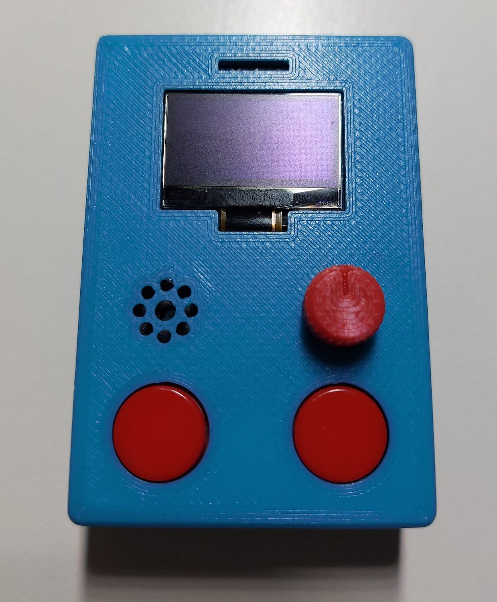

#Arkanoid for Arduino Nano
Porting of the Arkanoid game (breakout) to Arduino Nano.
Starting from the lexus2k/ssd1306 repo (link at the bottom) I optimized the code of the Arkanoid example for Arduino Nano, then I fixed some bugs, like an infinite loop when hitting the corner of some bricks.
Then I added the movement of the base with two possible options:
- if at boot you hold down both front buttons, they will move the base during the whole game
- if at boot you do not press anything, the base will be moved by the analog potentiometer

###Components List
- Arduino Nano
- SSD1306 oled display
- 10K potentiometer
- tactile buttons (x2 for front buttons, x1 for reset)
- slide switch (for mail power)
- buzzer
- 10K resistors (x2)
- 100uF capacitor
- charger module and step-up for 5V
- lipo battery

base projects where I started:
- https://github.com/lexus2k/ssd1306
